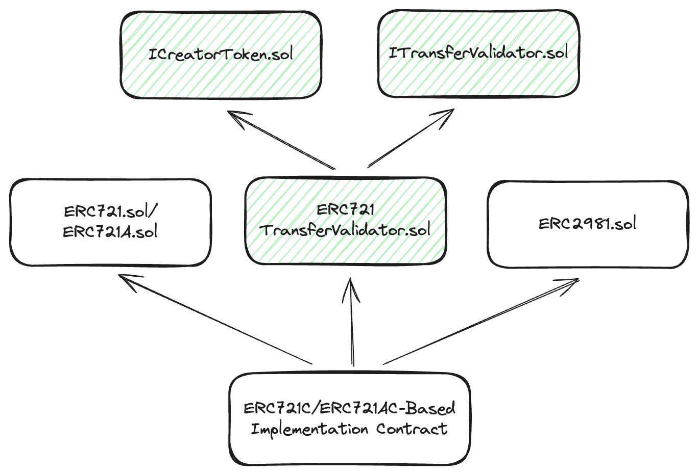
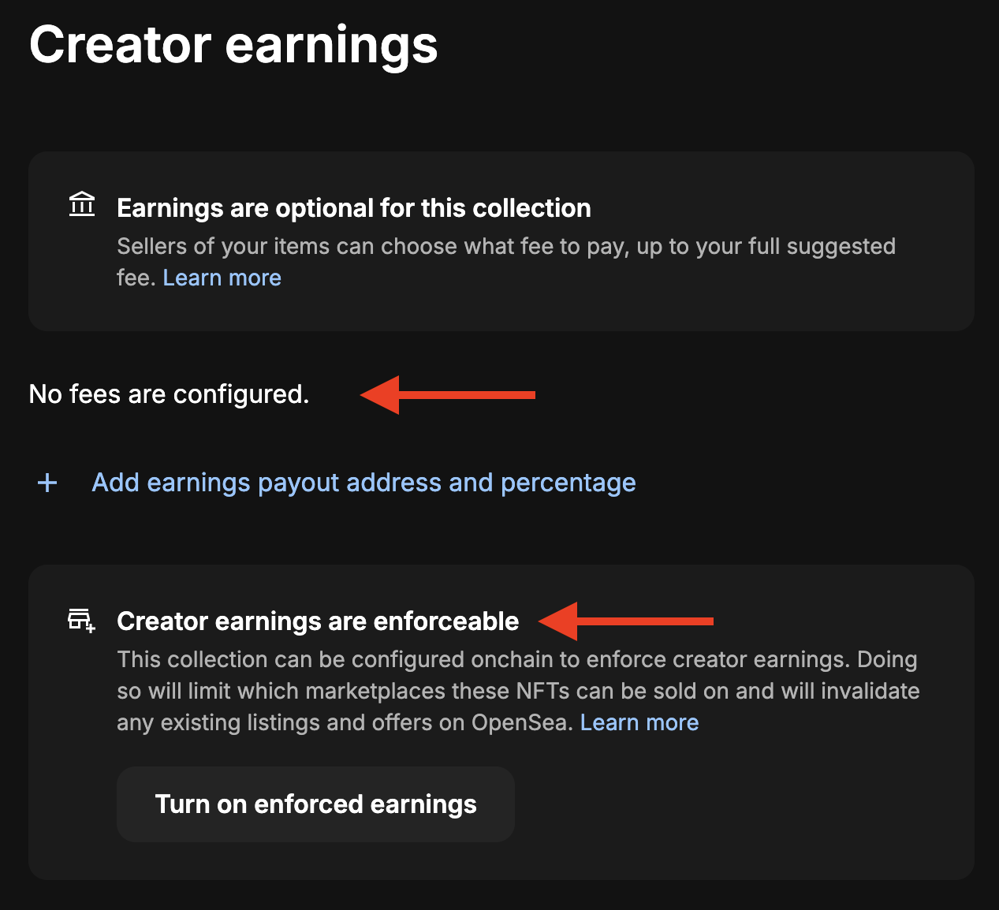
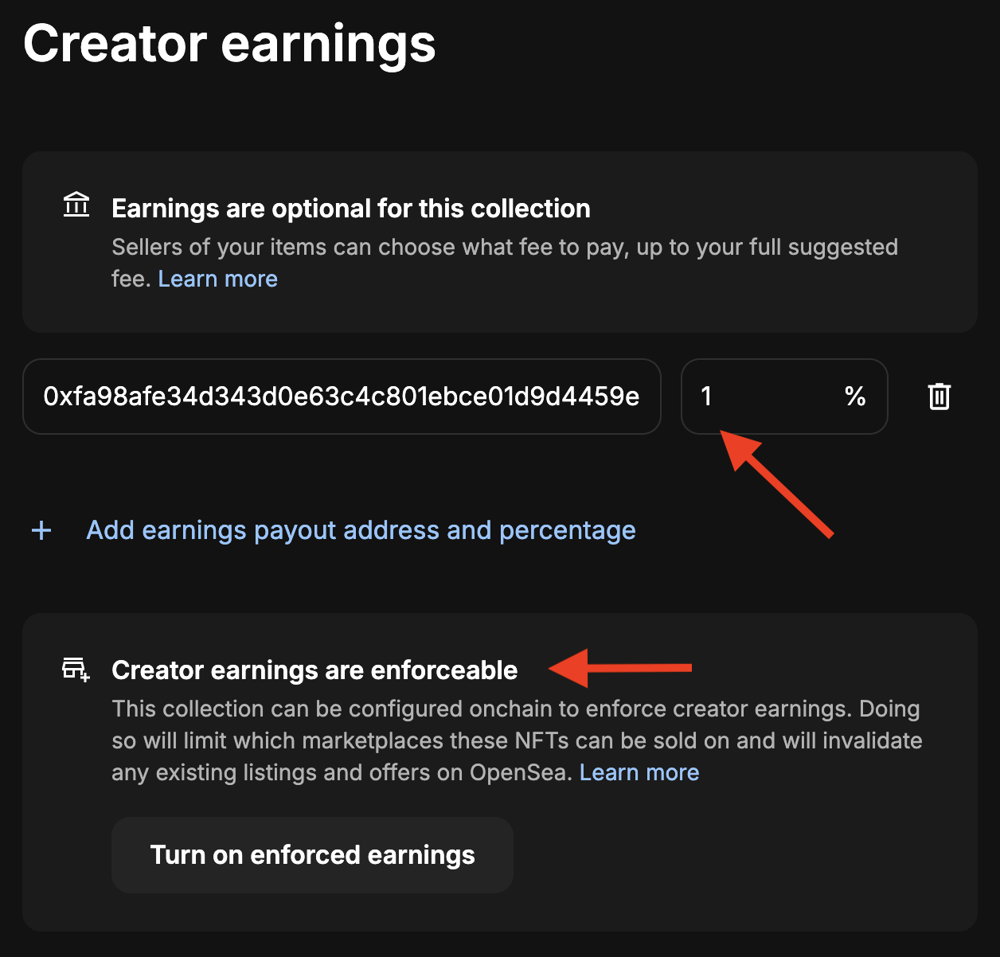
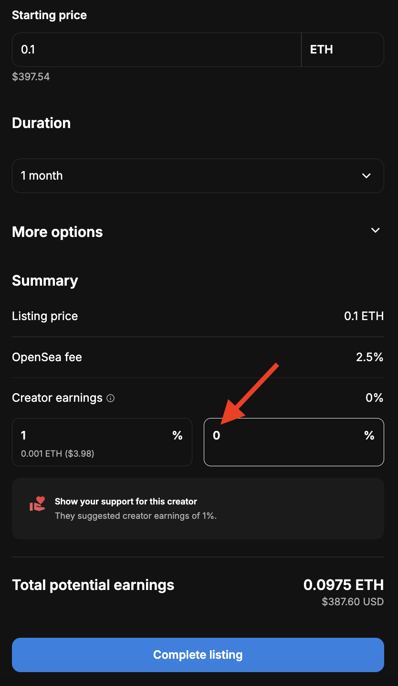
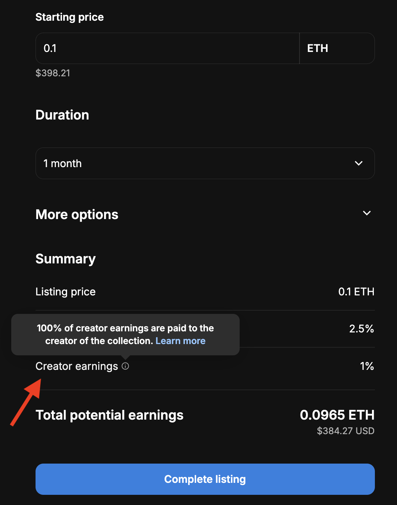
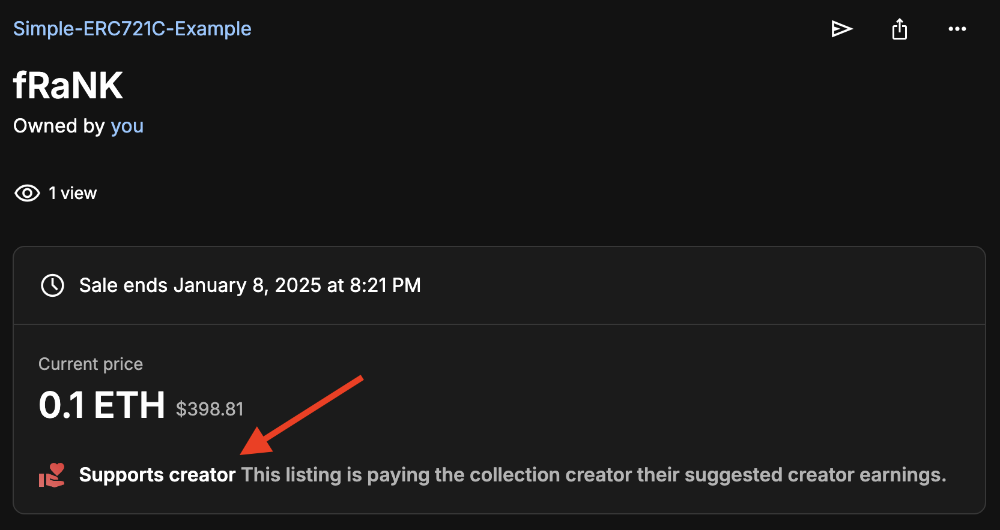

# Simple ERC721 Creator Fee Enforcement Extension

## Background
In April 2024, OpenSea announced that creators can now use [ERC721-C](https://github.com/limitbreakinc/creator-token-contracts/tree/main) from [Limit Break](https://limitbreak.com/index.html) to set and enforce their own creator earnings on OpenSea ([link](https://opensea.io/blog/articles/creator-earnings-erc721-c-compatibility-on-opensea)).

The article stated that its also applicable for the creator who's using ERC721-C or ERC1155-C compatible custom smart contract. I've found [examples](https://github.com/limitbreakinc/creator-token-contracts/tree/main/contracts/examples) from LimitBreak's github repo but it doesn't suit my needs. So, I decided to make a simple extension based on [OpenSea's Creator Fee Enforcement docs](https://docs.opensea.io/docs/creator-fee-enforcement) without having to inherit to LimitBreak's ERC721-C.

## About
This repository is specifically about simple ERC721-C contract extension to be inherited by any kind ERC721-based implementation contract. There are two examples of its implementation based on ERC721 base contracts:
1. [ERC721C](https://github.com/0xkuwabatake/simple-ERC721C-extension/blob/main/src/examples/ERC721C.sol) is for ERC721-based contract.
2. [ERC721AC](https://github.com/0xkuwabatake/simple-ERC721C-extension/blob/main/src/examples/ERC721AC.sol) is for ERC721A-based contract.

## Implementations

1. Implementation contract MUST inherit to [ERC721TransferValidator.sol](https://github.com/0xkuwabatake/simple-ERC721C-extension/blob/main/src/extensions/ERC721TransferValidator.sol). The contract inherits to [ICreatorToken.sol](https://github.com/0xkuwabatake/simple-ERC721C-extension/blob/main/src/interfaces/ICreatorToken.sol) and [ITransferValidator721.sol](https://github.com/0xkuwabatake/simple-ERC721C-extension/blob/main/src/interfaces/ITransferValidator721.sol) -- see diagram (above).
2. Implementation contract SHOULD inherit to ERC2981 contract. In this case, we're using [ERC2981 from solady](https://github.com/Vectorized/solady/blob/main/src/tokens/ERC2981.sol) -- see diagram (above).
3. Implementation contract MUST have `setTransferValidator`([link](https://github.com/0xkuwabatake/simple-ERC721C-extension/blob/main/src/examples/ERC721C.sol#L55)) external as [its defined at ICreatorToken.sol](https://github.com/0xkuwabatake/simple-ERC721C-extension/blob/main/src/interfaces/ICreatorToken.sol#L26) with access control.
3. Override [supportInterface](https://github.com/0xkuwabatake/simple-ERC721C-extension/blob/main/src/examples/ERC721C.sol#L64) to also returns `true` for `0xcaee23ea` for ERC721 transfer validator function signature's interface ID and `0x2a55205a` for ERC2981's interface ID.
4. Override `_beforeTokenTransfer` hook ([ERC721C](https://github.com/0xkuwabatake/simple-ERC721C-extension/blob/main/src/examples/ERC721C.sol#L100) / [ERC721AC](https://github.com/0xkuwabatake/simple-ERC721C-extension/blob/main/src/examples/ERC721AC.sol#L95)).
5. There are two ways to set transfer validator contract:
    - After contract is deployed OR
    - [Inside the constructor](https://github.com/0xkuwabatake/simple-ERC721C-extension/blob/main/src/examples/ERC721AC.sol#L30) along with `_setDefaultRoyalty` from ERC2981

## Deployed Contracts at Testnet

| Contract | Address                                                                                                                       | OpenSea(testnets)
|----------|-------------------------------------------------------------------------------------------------------------------------------|-------------------------------------------------------------------------------------------|
| ERC721C  | [0x1FeB3f98e42Ccb79DDb9462d2f041d0DAded4c05](https://sepolia.basescan.org/address/0x1feb3f98e42ccb79ddb9462d2f041d0daded4c05) | [Simple-ERC721C-Example](https://testnets.opensea.io/collection/simple-erc721c-example)   |
| ERC721AC | [0x68Db515f9FC5173E78153E6449C8420De07bEE02](https://sepolia.basescan.org/address/0x68db515f9fc5173e78153e6449c8420de07bee02) | [Simple-ERC721AC-Example](https://testnets.opensea.io/collection/simple-erc721ac-example) |

## Tests

Test belows are based on deployed contracts and OpenSea's collection page at testnets (above).

1. This is what we see at `Creator earnings` tab at OpenSea's collection settings when transfer validator contract is not set -- `getTransferValidator` [returns zero address](https://github.com/0xkuwabatake/simple-ERC721C-extension/blob/main/src/extensions/ERC721TransferValidator.sol#L38).

2. After fees were configured via OpenSea but transfer validator contract has not been set yet.

3. NFT's owner listing a NFT for sale. The owner has an option to not paying creator fee (creator fee sets to 0%), because transfer validator contract is not set.

4. Listed NFT when transfer validator contract is not set.

5. Transaction hash when listed NFT (#4) is bought:
[https://sepolia.basescan.org/tx/0x37ee9e0b79e79da2b60a542cabff589f757e8cccb1daf57e305afa5f5f966b5e](https://sepolia.basescan.org/tx/0x37ee9e0b79e79da2b60a542cabff589f757e8cccb1daf57e305afa5f5f966b5e)

6. This is what we see at `Creator earnings` tab when transfer validator contract is set ([Transaction's log](https://sepolia.basescan.org/tx/0xc6c49bf3694974fd82e35c5a69434f9fdd09078086aae8973ae925aaacdcbf42#eventlog))

7. NFT's owner listing a NFT for sale. The seller has NO option to not paying creator fee (creator fee is enforced), because transfer validator contract has been set.

8. Listed NFT when transfer validator contract has been set.

9. Transaction hash when listed NFT (#7) is bought:
[https://sepolia.basescan.org/tx/0xa1aceeb4d754c681090d4534d76b8280aeac0f6d27a236ac05f29bdf88ef6c54](https://sepolia.basescan.org/tx/0xa1aceeb4d754c681090d4534d76b8280aeac0f6d27a236ac05f29bdf88ef6c54)

## Important Notes
The contract had not been audited and unit tested, so use it with caution.